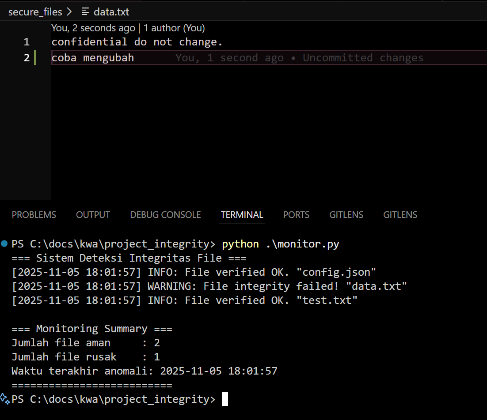
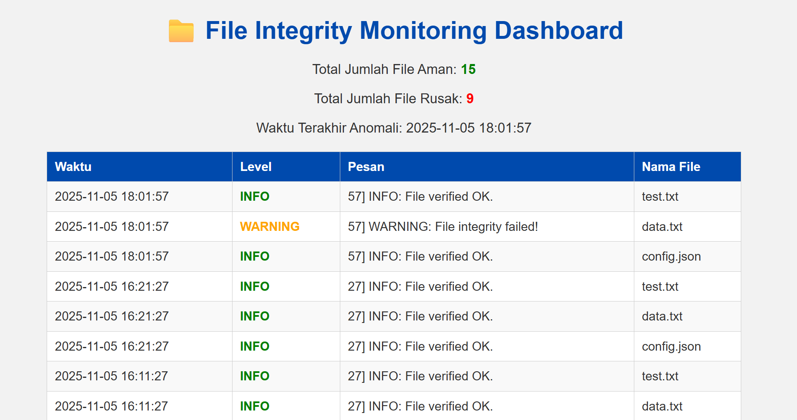
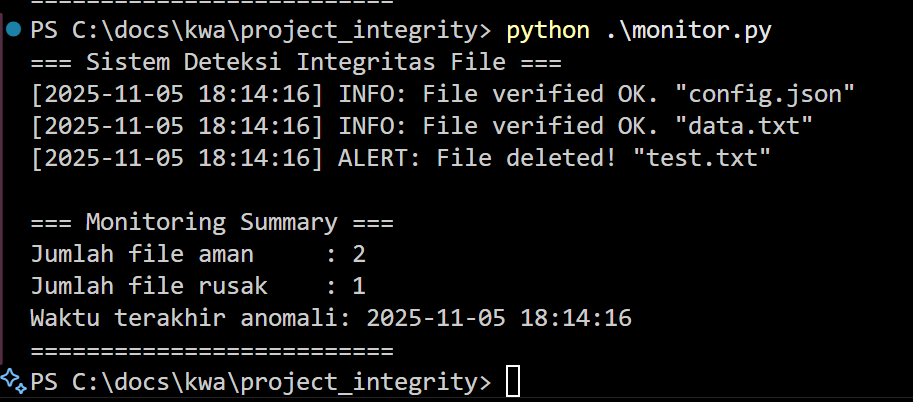
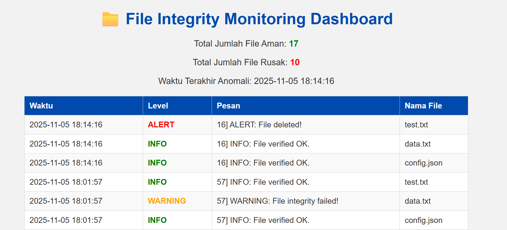
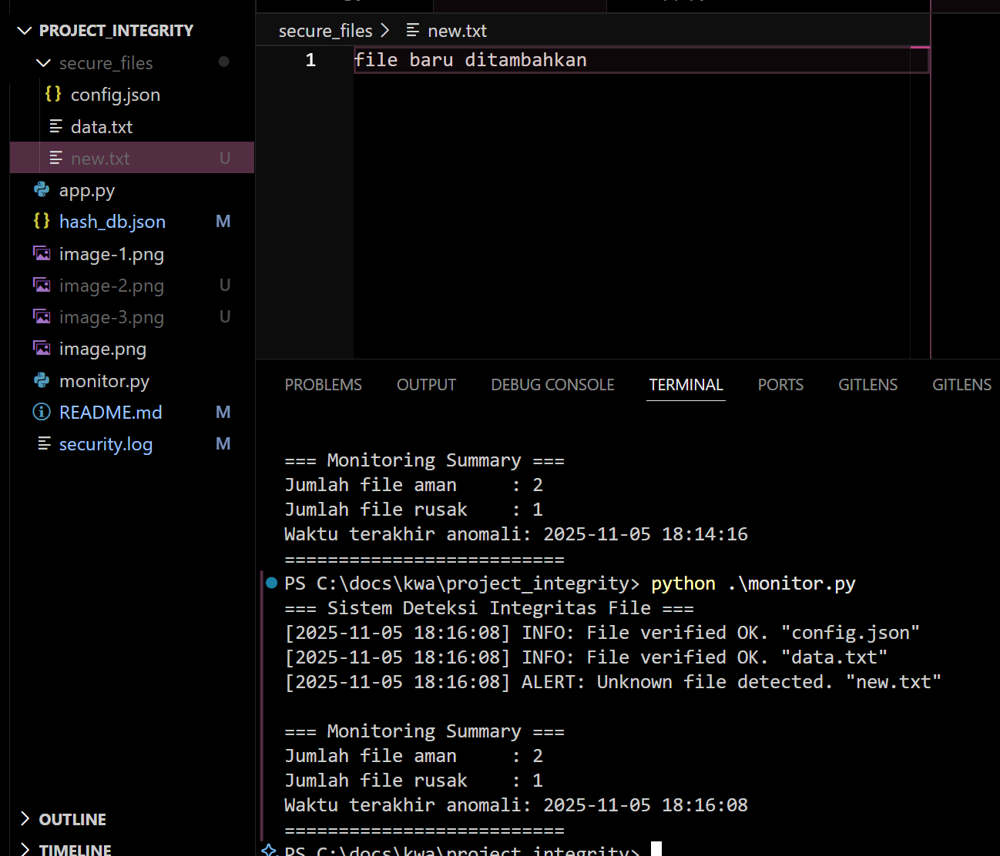
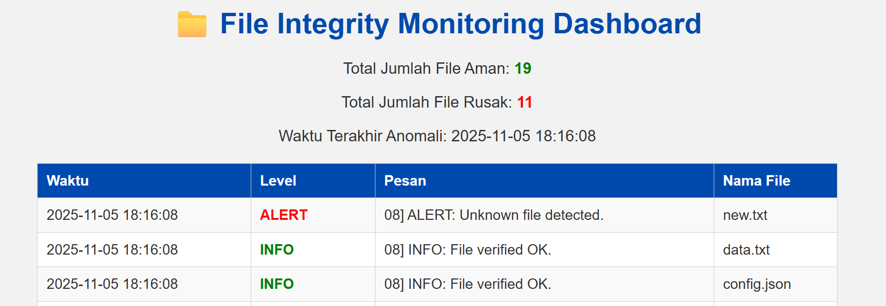
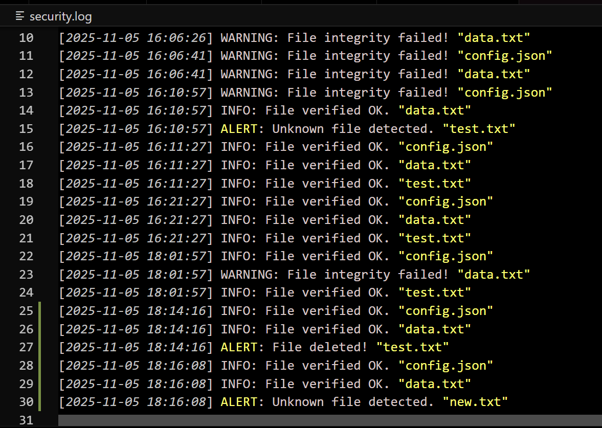

# KWA Project Integrity
 Anggota Kelompok:
 - Revalina Fairuzy Azhari Putri (5027231001)
 - Chelsea Vania Hariyono (5027231003)
 - Salsabila Rahmah (5027231005)
 - Farida Qurrotu A'yuna (5027231015)
 - Nayyara Ashila (5027231083)

 ## Cara Menjalankan Program
 1. Buat struktur folder sebagai berikut
 ```
 project_integrity/
│
├── secure_files/
│   ├── data.txt
│   └── config.json
│
├── hash_db.json
├── security.log
├── monitor.py
└── app.py

 ```
 **Notes!** <br>
 - hash_db.json dan security.log akan ter-generate setelah menjalankan monitor.py <br>
 - Isi semua file dalam folder secure_files bebas
 2. Jalankan monitor.py
 ```
 python monitor.py
 ```
 3. Buka terminal baru dan jalankan app.py
 ```
 python app.py
 ```
 4. Lakukan percobaan dengan mengubah, menambahkan, maupun menghapus isi atau file itu sendiri dalam folder secure_files dan jalankan kembali monitor.py.

 5. Refresh pada website untuk menampilkan versi terbaru.

 ## Dokumentasi Pengerjaan
### Case 1: Mengubah salah satu isi file
 
 

### Case 2: Menghapus salah satu file
Dalam kasus ini, file yang dihapus adalah test.txt
 
 

### Case 3: Menambahkan file baru "new.txt"
 
 

 ### Isi dari security.log
 